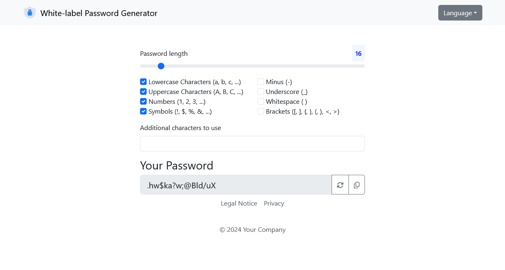
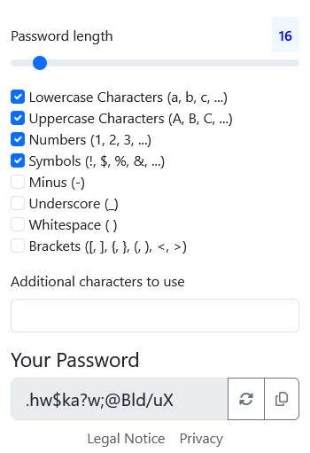

# Whitelabel Password Generator 

[](https://github.com/fkaratas/whitelabel-password-generator/actions/workflows/build.yml)
[](https://docs.oracle.com/javase/8/)

[](https://sonarcloud.io/summary/overall?id=fkaratas_whitelabel-password-generator)
[](https://sonarcloud.io/summary/overall?id=fkaratas_whitelabel-password-generator)
[](https://sonarcloud.io/summary/overall?id=fkaratas_whitelabel-password-generator)
[](https://sonarcloud.io/summary/overall?id=fkaratas_whitelabel-password-generator)
[](https://sonarcloud.io/summary/overall?id=fkaratas_whitelabel-password-generator)

Whitelabel Password Generator (WPG) is a simple Spring Boot application to host your own Password Generator running in a browser. Extend or brand it according to your needs. A running example can be found [here](https://www.pwd-generator.com).

## Screenshots

Thanks to bootstrap the application is mobile first and runs in normal desktop browsers as well as on mobiles phones
<div class="center">
    
    
</div>

## Building

**WPG** requires at least **Java 17** to compile and has been tested with versions up to **Java 21**. In order to build **WPG** simply clone the repository or download the sources and build it via command line: 
```
./mvnw clean verify
```

## How to use it

Since WPG is a Spring Boot application, the easiest way to get started is to build the application as a runnable jar
```
./mvnw clean package
```

and then simply running it

```
java -jar <folder and name of jar file>
```

Of course there are plenty of further options such as building and deploying a docker image, installing the application as systemd service, etc. Please refer to the official Spring Boot documentation for further information on how to [deploy Spring Boot applications](https://docs.spring.io/spring-boot/3.4/how-to/deployment/index.html)

## License

[MIT License](LICENSE)
